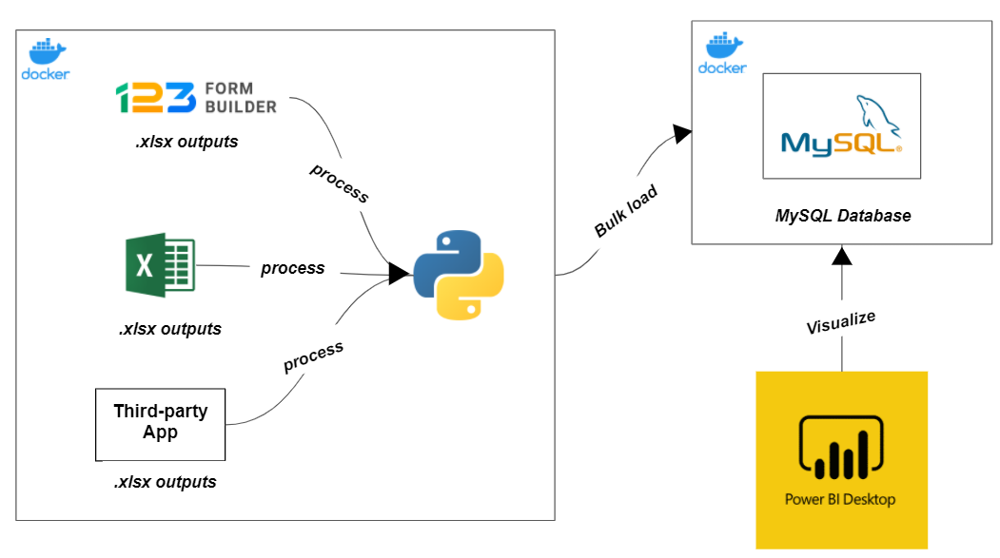
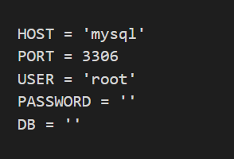
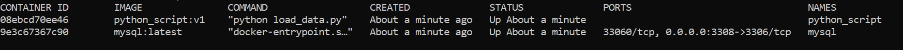
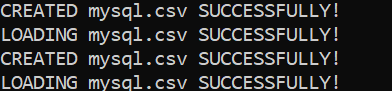
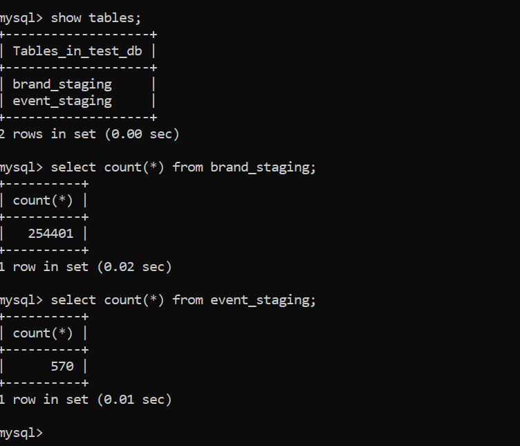
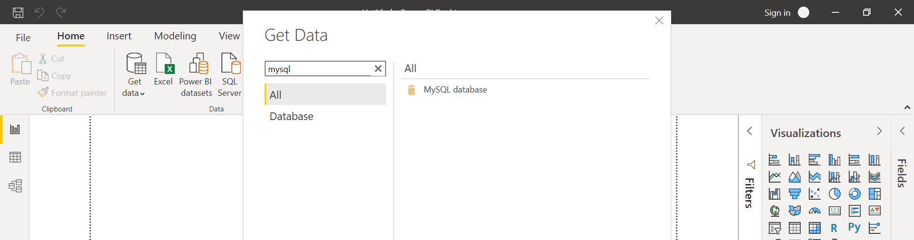
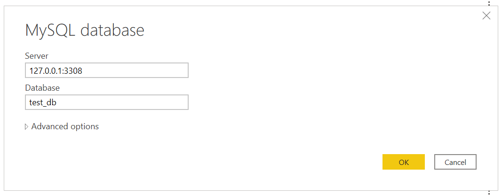
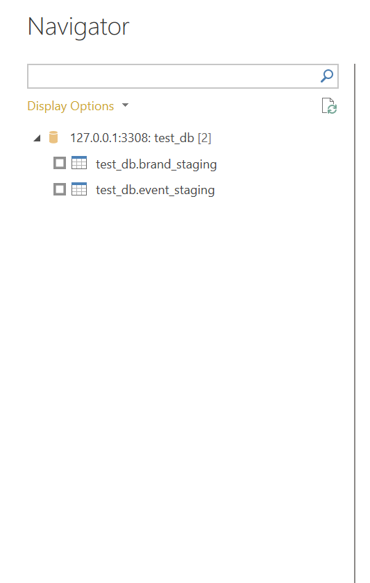
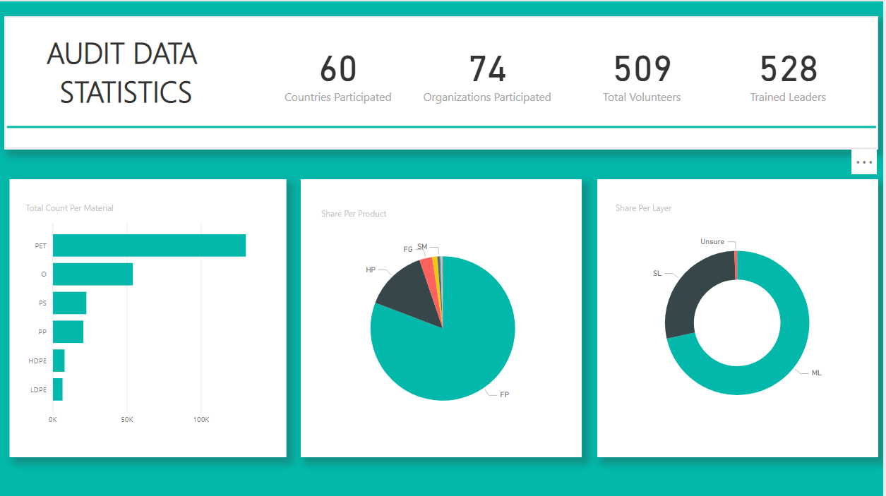

# Containerized Python-MySQL Data Pipeline

## About the Project

Suppose we have a company that does an audit every year and their data comes from three different sources (as indicated below) with varying formats:

1. Excel Templates -> .xlsx output
2. 123FormBuilder -> downloaded .xlsx output
3. Third-party App -> downloaded .xlsx output

Now, you're tasked to consolidate all three data sources and store them in a database for analysis. Huge plus if you can translate them into a dashboard or visualizations.

---
## Tools
- Python - Consolidating the various .xlsx outputs into one format, creating the tables in MySQL, bulk load data to MySQL
- MySQL - Database to store the consolidated data and where PowerBI will pull data from
- Docker - Containerize our python script and MySQL database
- PowerBI - Visualization tool (Desktop version)
 
---
## Overview

---
## Project Directory
- data
    - 123Forms - Contains the .xlsx files from this data source
    - Excel - Contains the .xlsx files 
    - ThirdParty - Contains the .xlsx files from this data source
- etl_scripts
    - excel.py - Data transformation script for data coming from Excel templates
    - online_forms.py - Data transformation script for 123Form's data
    - thirdparty.py - Data transformation script for ThirdParty's data
    - reference.py - Just a data dictionary on which columns to keep, and renaming of columns
- mysql_loader
    - utils.py - script that does the bulk loading to mysql (using local infile)
- utilities
    - utils.py - utility script that gets the .env variables containing the host, port, user, passwd, db
- config.py - assigns the data filepaths to variables and the names of the table in the database

- create_tables.py - script that creates the table in the database, will be called from load_data.py

- load_data.py - main script that calls create_tables.py, transform the data using the etl_scripts, and load data to MySQL

- Dockerfile - Contains the steps to build the image of my Python script setup

- docker-compose.yml - YAML file to configure connection of the `python script` to `mysql`

---
## Replicate the setup

Assuming you have Docker and docker-compose installed,

1. Clone the repository
2. `cd` to the repository
3. Create a .env file in the root directory. Inside the .env file, fill this up (*Note: HOST is set to 'mysql' because that's the name of our service inside the docker-compose file*)

     

3. Run `docker-compose up`
4. Docker will run the images specified on your docker-compose file
5. Run `docker ps` to verify that the containers are running

    

---
## Check if the python script has ran successfuly and that data has loaded

First, let's check if our python script was able to transform the data successfully and load them to mysql

1. A few minutes after the containers have started running, you can try running `docker ps` on your command line again. You should see only the mysql container is left running. If not, that means the python script is still not done transforming and loading the data. 

2. To check if the python_script has ran successfuly, run `docker logs python_script` (*python_script is our container name*), and you should be able to see this

    

3. Now, we can try verifying it inside our mysql container itself if the data is really there. Try running `docker exec -it mysql bash`

4. Type `mysql -uroot -p [db_name_from_your_env_file]`. Then enter the password you've specified on your .env file.

5. Finally, you can type the following mysql commands. (*Note: You might be seeing different values for count since I reduced the dummy data for this repo.*)

    

---
## Connect to MySQL Container from PowerBI

Now, without stopping your MySQL container, let's try to connect it to PowerBI and add some visualizations.

You can download PowerBI desktop [here!](https://powerbi.microsoft.com/en-us/downloads/)

1. On Power BI, select `Get Data` and search for MySQL database.

    

2. Select MySQL database, and click Connect. You will be prompted for your credentials. For the server, type in `127.0.0.1:3308` where 3308 is the host port we specified in our docker-compose file. For database, type the db name you specified inside the .env file.

    

3. Click `OK`

4. You should be able to see the two tables from the db. You can choose to transform them if you want. For my case, I'll just load them directly.

    

5. Now, you can do some visualizations. Below is just a sample dashboard that I created (badly put). Values may vary since I'm using a different set of dummy data.

    
